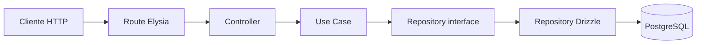
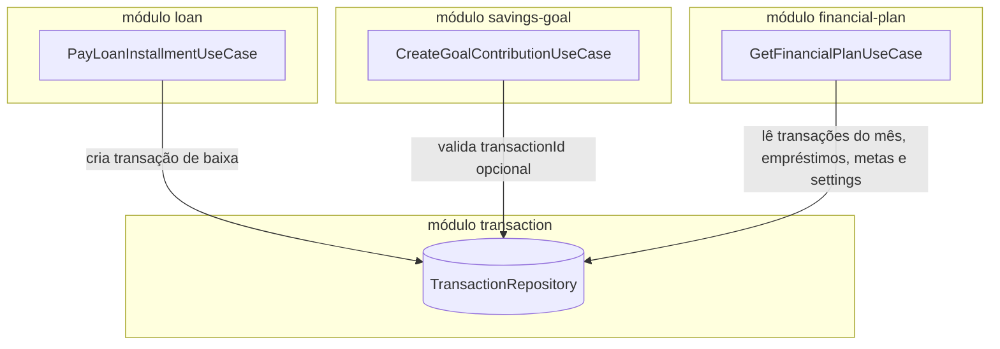
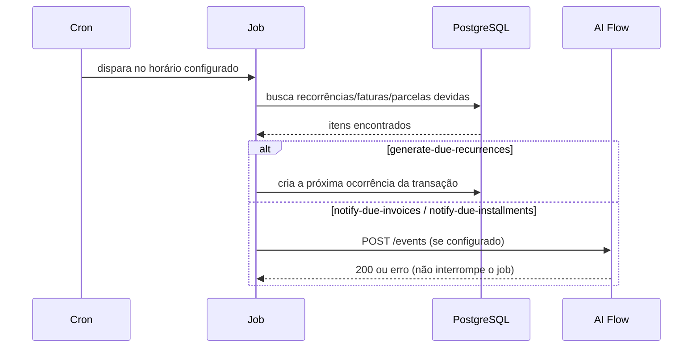

# Arquitetura da API

Cada módulo da API é uma fatia vertical com três camadas.

## Fluxo de uma requisição

| Camada | Responsabilidade |
| --- | --- |
| Route | define endpoint, schema Zod do body/query e documentação OpenAPI |
| Controller | chama um único caso de uso e monta a resposta com `ApiResponse` |
| Use Case | contém as regras de negócio, validações e conflitos entre entidades |
| Domain | contratos de repositórios e enums — sem Elysia nem Drizzle |
| Infra | consulta PostgreSQL via Drizzle, mapeia linhas para DTOs |

## Regra de dependência

`domain/` não importa Elysia nem Drizzle; `app/` depende só de `domain/`; `infra/` é a única camada que toca framework, banco ou implementações concretas de outros módulos. `routes/*.routes.ts` é o único lugar que instancia repositórios Drizzle concretos e monta os casos de uso (`buildController()`).

## Casos de uso que atravessam módulos

Um caso de uso pode receber, no construtor, interfaces de repositório de **outros** módulos — nunca a implementação Drizzle diretamente. Três exemplos reais:

- **`PayLoanInstallmentUseCase`** (módulo `loan`) grava uma transação de despesa real na conta do financiamento ao pagar uma parcela — a baixa da parcela e o lançamento financeiro são a mesma operação, não dois passos separados.
- **`CreateGoalContributionUseCase`** (módulo `savings-goal`) aceita vincular um aporte a uma transação já existente, validando que ela pertence ao usuário.
- **`GetFinancialPlanUseCase`** (módulo `financial-plan`) não tem tabela própria — só agrega, em memória, dados que já existem em `financial-settings`, `transaction`, `loan` e `savings-goal`.

## Valores derivados não são fonte de verdade

Saldo de conta, progresso de meta, saldo devedor de financiamento, valor realizado de orçamento e posição de investimento são **calculados a partir das transações/movimentos**, nunca armazenados como coluna própria:

| Valor derivado | Calculado a partir de |
| --- | --- |
| Saldo atual/projetado da conta | soma das transações `completed` / `completed+planned+pending` |
| Realizado do orçamento | soma das transações de despesa da categoria no mês |
| Saldo devedor do financiamento | principal − soma do `principalPortion` das parcelas pagas |
| Progresso da meta | soma dos aportes vs. `targetAmount` |
| Posição do investimento | soma dos movimentos (compra/venda/aporte/resgate) × preço mais recente |
| Contas fixas do mês / sobra do painel | transações de despesa do mês + próxima parcela em aberto de cada financiamento |

Essa regra evita que um valor guardado fique desatualizado em relação ao que realmente aconteceu.

## Paginação

Toda listagem usa cursor opaco (UUIDv7), documentado em [Endpoints e respostas](./endpoints/index.md#paginacao-e-filtros).

## Jobs em segundo plano

Os jobs de notificação avisam no log e retornam sem erro quando `AI_FLOW_API_URL`/`AI_FLOW_API_KEY` não estão configurados — não é um requisito para o resto do sistema funcionar.

## Inicialização

`src/index.ts` configura CORS (a partir de `FRONT_URLS`), OpenAPI, tratamento global de erros, os três jobs em segundo plano e as rotas de cada módulo. A validação do ambiente (`src/env.ts`) ocorre antes da aplicação começar a escutar a porta.
