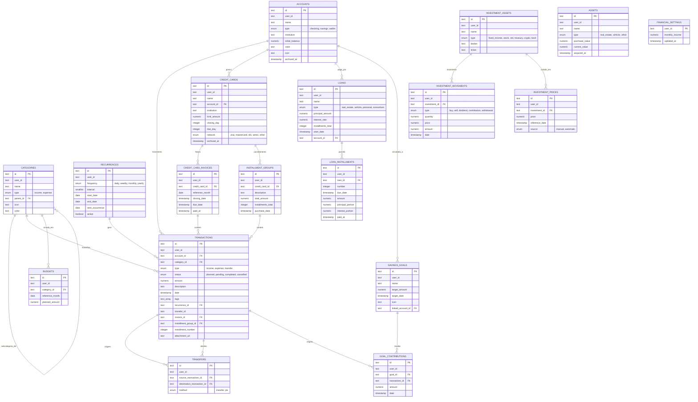

# Banco de dados

O AI Financial usa PostgreSQL com Drizzle ORM. Schemas ficam em `src/db/schema` e migrations em `src/db/migrations`.

## Diagrama ER



`PK` indica chave primária e `FK` chave estrangeira. Toda tabela carrega `user_id` (sem `FK` para uma tabela de usuários, já que a autenticação ainda não existe — veja [Identidade](./overview.md#identidade)). `FINANCIAL_SETTINGS` não aparece com relacionamento porque é lida por `user_id` diretamente, uma linha por usuário.

## Tabelas por domínio

| Domínio | Tabelas |
| --- | --- |
| contas e transações | `accounts`, `categories`, `transactions`, `transfers`, `recurrences` |
| cartão de crédito | `credit_cards`, `credit_card_invoices`, `installment_groups` |
| orçamento | `budgets` |
| financiamentos | `loans`, `loan_installments` |
| metas de economia | `savings_goals`, `goal_contributions` |
| investimentos | `investment_assets`, `investment_movements`, `investment_prices` |
| patrimônio | `assets` |
| planejamento | `financial_settings` |

## Pontos de atenção do schema

- **`transactions.transfer_id`** não tem `FK` declarada — evita referência circular, já que uma transferência (`transfers`) referencia duas transações, e cada uma dessas transações poderia querer apontar de volta para a transferência.
- **`transactions.installment_number`** existe sem um `installments_total` na própria linha — o total vive em `installment_groups.installments_total`, referenciado por `installment_group_id`.
- **`loan_installments`** guarda `principal_portion`/`interest_portion` separados por parcela (tabela de amortização Price/French pré-calculada na criação do financiamento) — o saldo devedor é a soma do `principal_portion` das parcelas ainda não pagas.
- **`goal_contributions.transaction_id`** é opcional — um aporte pode ser só um registro manual, sem transação real associada.

## Migrations

```bash
bun run db:generate
bun run db:migrate
bun run db:seed
bun run studio
```

::: warning
Não edite SQL gerado manualmente. Altere o schema Drizzle, gere a migration e revise o arquivo antes de aplicar.
:::
