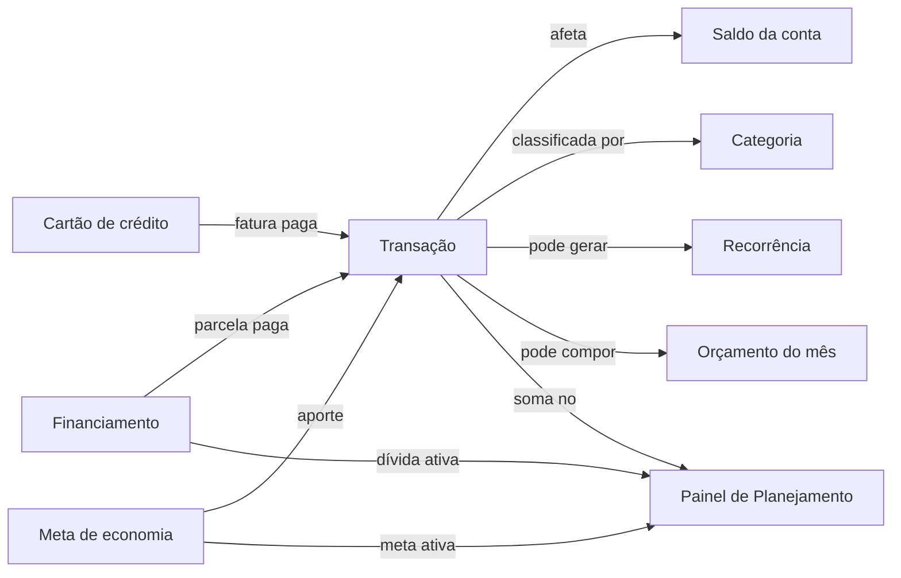

# AI Financial

Controle financeiro pessoal: contas, transações, cartões de crédito, orçamento, financiamentos, investimentos, metas de economia e um painel de planejamento que cruza renda, contas fixas e dívidas.

## Escolha seu caminho

- **Quero instalar:** leia [Configuração e instalação](./api/configuration.md).
- **Quero utilizar o app:** siga o [Manual de utilização](./utility/overview.md).
- **Quero desenvolver ou integrar:** consulte [API e tecnologias](./api/overview.md).
- **Quero entender um recurso:** abra a seção **AI Financial** na navegação lateral.

## Conceito central

Toda movimentação de dinheiro no sistema é, na base, uma **transação** — pagar uma parcela de financiamento, fechar uma fatura de cartão ou aportar numa meta lança uma transação real na conta correspondente. Saldos, orçamento realizado e o painel de planejamento são sempre **calculados a partir das transações**, nunca guardados como um segundo valor que possa ficar desatualizado.
