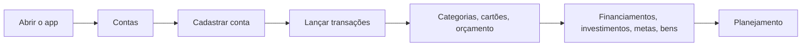

# Manual de utilização

Este manual ensina como utilizar as telas do AI Financial.

*Contas: primeira tela do app, com o saldo atual e projetado de cada conta.*

::: primary
Use este manual durante a operação do app. Para instalação e detalhes de API, consulte as seções Configuração e API e tecnologias.
:::

## Fluxo geral

## Primeiro acesso

Se esta é sua primeira vez no app, siga antes o guia [Começando no AI Financial](./getting-started.md). Ele explica desde cadastrar a primeira conta até ver o painel de planejamento com dados reais.

## Menu lateral

O menu reúne:

- **Contas**: bancos, poupança e carteira, com saldo atual e projetado;
- **Transações**: lançamentos, transferências e contas fixas (recorrentes);
- **Categorias**: classificação de receitas e despesas;
- **Cartões**: cartões de crédito e suas faturas;
- **Orçamento**: valor planejado por categoria e mês, comparado ao realizado;
- **Planejamento**: renda mensal, contas fixas do mês, dívidas e metas em um painel único;
- **Financiamentos**: empréstimos com tabela de parcelas;
- **Investimentos**: ativos, aportes/resgates e cotação;
- **Metas**: valor-alvo e aportes até alcançá-lo;
- **Bens**: patrimônio fora do fluxo de transações (imóveis, veículos).

## Padrões das listagens

1. Digite no campo de pesquisa (quando existir).
2. Acione a pesquisa; apenas digitar não necessariamente atualiza a lista.
3. Use limpar para remover o filtro.
4. Escolha 5, 10, 20 ou 50 itens por página.
5. Use Próxima ou Anterior.
6. Clique na linha para visualizar ou editar.
7. Use o ícone de arquivar/apagar somente depois de conferir a confirmação.

## Padrões dos formulários

- em um cadastro existente, selecione **Editar** antes de alterar;
- **Salvar** confirma as mudanças;
- **Cancelar** descarta a edição atual;
- mensagens no canto da tela informam sucesso, alerta ou erro;
- valores monetários usam máscara de moeda (`R$`) — digite só os números.

### Como interpretar os retornos

| Tipo | Significado | O que fazer |
| --- | --- | --- |
| mensagem de sucesso | a operação foi concluída | aguarde o retorno à lista ou confira o item atualizado |
| `Campos obrigatórios` | um campo exigido está vazio ou inválido | revise os campos destacados |
| confirmação de arquivamento/exclusão | a ação afeta o cadastro | confira o nome antes de confirmar |
| erro ao carregar | a lista não foi obtida | atualize a página |
| já existe/conflito | cadastro duplicado ou já pago/quitado | pesquise o item existente antes de tentar novamente |

Não clique repetidamente em **Salvar** enquanto o botão estiver carregando. Aguarde o retorno para evitar lançamentos duplicados.

## Arquivar × excluir

O app usa **arquivar** para contas e cartões (preserva o histórico de transações) e **excluir** para cadastros sem movimentação real, como categorias, orçamentos, bens e ativos de investimento. Uma conta ou cartão arquivado some dos seletores de novas transações, mas continua aparecendo no histórico.
